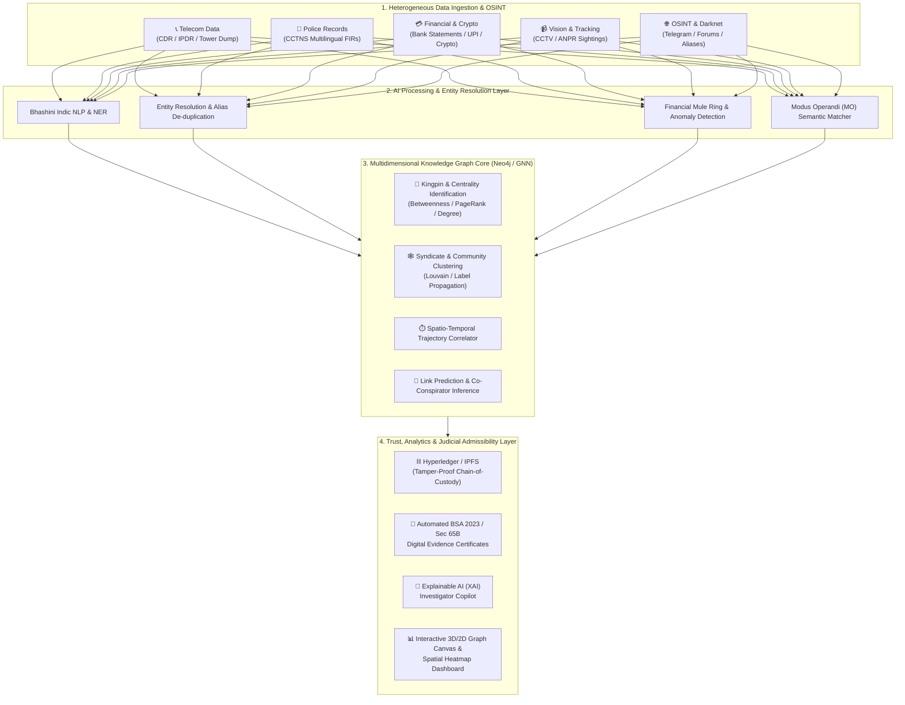

# 🛡️ Project SHADOW-INTEL (SIH26189)
### *Next-Generation AI-Powered Criminal Network Analysis & Law Enforcement Intelligence Platform*

[](https://sih.gov.in)
[-blue.svg?style=for-the-badge)](https://www.mha.gov.in)
[](#)
[](#)
[](#)

---

## 📌 Executive Summary & Problem Overview

* **Main Problem Statement ID:** `SIH26189`
* **Title:** **AI-Powered Criminal Network Analysis System**
* **Organization:** **Ministry of Home Affairs (MHA)** *(Supported by BPR&D / NCRB / I4C / NIA)*
* **Category:** Software
* **Core Challenge:** 
  Modern organized crime, cyber syndicates, terror financing, and inter-state rackets operate across deeply fragmented, multi-modal channels. Indian Law Enforcement Agencies (LEAs) routinely deal with petabytes of disconnected data: Call Detail Records (CDR), Tower Dumps, IPDR, multilingual First Information Reports (FIRs), bank statements, UPI transactions, cryptocurrency ledgers, CCTV sightings, and OSINT chatter. 

  Manual analysis is slow, error-prone, and misses hidden "kingpins" who insulate themselves behind multi-hop operational layers. **Project SHADOW-INTEL** solves this by unifying heterogeneous data streams into an intelligent, multidimensional knowledge graph powered by graph AI, multilingual NLP, predictive spatial-temporal modeling, and a tamper-proof blockchain chain-of-custody.

---

## 🌐 The "Think Big" Vision: Unified MHA Ecosystem Matrix

To build a national-scale flagship defense platform, **Project SHADOW-INTEL** seamlessly incorporates key allied problem statements and initiatives under the **Ministry of Home Affairs (MHA)**:

| # | MHA Focus Domain & Allied Problem Statement | Core Challenge Addressed | How It Integrates into SIH26189 |
|---|---|---|---|
| **1** | **Digital Evidence Management & Chain of Custody (BSA & Sec 65B Compliance)** | Tampering of forensic data, lack of audit trails, and inadmissible evidence in court. | **Blockchain Ledger (Hyperledger/IPFS):** Immutable hashing of every ingested CDR, FIR, and visual proof to guarantee non-repudiation and automated Section 65B / BSA certificate generation. |
| **2** | **Cyber Financial Fraud & Mule Account Ring Detection (I4C / 1930 Portal)** | Rapid layering of stolen money through mule accounts, shell companies, and crypto mixers. | **Financial & Crypto Graph Analytics:** Trace multi-hop UPI/bank transactions, detect circular transactions, synthetic identities, and flag crypto wallet clusters (USDT/Bitcoin). |
| **3** | **Multilingual FIR & Police Record NLP (CCTNS / ICJS Interoperability)** | Millions of FIRs written in diverse Indic languages and scanned PDFs across state borders. | **Multilingual NLP & Modus Operandi (MO) Matching:** Use Indic NER (Bhashini-powered) to parse Hindi/regional FIRs, extract suspects, weapons, locations, and link inter-state gang crimes. |
| **4** | **OSINT & Darknet Threat Intelligence Crawler (SOCMINT)** | Criminals coordinating via Telegram groups, darknet forums, and social media aliases. | **OSINT Harvester:** Ingest handles, aliases, phone numbers, and geolocation tags from public web/Telegram channels into the master graph node database. |
| **5** | **AI Video Analytics & Geospatial Trajectory Tracking (ANPR & CCTV)** | Manually combing through petabytes of CCTV footage and checkpoint cameras across cities. | **Spatial-Temporal Node Tracking:** Integrate Automatic Number Plate Recognition (ANPR) and face-match timestamps onto the interactive map/timeline view of suspect movements. |
| **6** | **Predictive Crime Hotspot & Syndicate Threat Scoring** | Reactive rather than proactive policing; anticipating gang wars, drug drops, and crime spikes. | **Predictive Risk Engine:** Spatio-temporal machine learning models predicting high-risk zones, gang collision likelihoods, and high-value node vulnerability scores. |

---

## 🏛️ System Architecture



---

## 🚀 Key Modules & Functional Capabilities

### 1. 👑 Syndicate & Kingpin Identification (Graph AI)
- **Centrality Algorithms:** Calculates Degree, Betweenness, Closeness, and Eigenvector centrality to identify key coordinators, bridge nodes, and insulated ringleaders.
- **Community Detection:** Unsupervised clustering (Louvain, Infomap, GNN embeddings) to isolate sub-cells, sleeper modules, and specialized roles (handlers, mules, logistics).
- **Link Prediction:** Identifies hidden relationships between seemingly disconnected suspects using path-based graph neural networks.

### 2. 📞 Telecom & Spatial-Temporal Analytics
- **CDR & IPDR Cross-Matching:** Analyzes calling patterns, mutual contacts, burner phone switching, and anomalous IMEI-IMSI pairing.
- **Tower Dump Geofencing:** Correlates presence of multiple suspect devices at crime scenes during critical time windows.
- **Interactive Timeline Slider:** Replay suspect communications and physical movements chronologically.

### 3. 💳 Cyber Financial Fraud & Mule Ring Detection
- **Multi-Hop Money Tracing:** Uncovers rapid layering across multiple UPI IDs, bank accounts, and shell entities within minutes of fraud execution.
- **Circular Transaction & Smurfing Detection:** Flags structured micro-transfers designed to evade anti-money laundering thresholds.
- **Crypto-Fiat Bridge:** Traces transactions across public blockchains (Bitcoin, USDT/TRON) linked to illicit extortion or drug payments.

### 4. 📄 Multilingual Indic Police NLP (CCTNS / ICJS Interoperable)
- **Bhashini-Powered Indic NLP:** Parses scanned and text FIRs in Hindi, Marathi, Tamil, Telugu, Bengali, Gujarati, and English.
- **Named Entity Recognition (NER):** Extracts suspect names, aliases, sections (BNS / IPC), weapons, vehicle numbers, and stolen items.
- **Modus Operandi (MO) Search:** Semantic similarity search to match current crime patterns against historical unsolved cases nationwide.

### 5. ⛓️ Blockchain Evidence Locker & BSA 2023 Compliance
- **Immutable Audit Trail:** SHA-256 / Keccak hashing of all ingested files logged onto a private permissioned ledger.
- **Chain-of-Custody Tracking:** Logs which officer accessed, exported, or modified investigative filters with timestamp and cryptographic signature.
- **Automated BSA 2023 / Sec 65B Dossier:** Single-click export of court-ready forensic reports with mathematical proofs of non-tampering.

---

## 🛠️ Technology Stack

| Layer | Technologies |
|---|---|
| **Frontend UI / UX** | React 19, Vite, TypeScript, TailwindCSS, Cytoscape.js / D3.js (Graph Canvas), Mapbox GL / Leaflet (GIS) |
| **Backend & APIs** | Python (FastAPI / Asynchronous Workers), Celery, Redis |
| **Knowledge Graph Database** | Neo4j Enterprise / Memgraph, NetworkX (Graph Analytics), Cypher Query Language |
| **AI / NLP / ML** | PyTorch, PyTorch Geometric (GNN), HuggingFace Transformers, IndicBERT / Bhashini API, spaCy |
| **Cyber & Telecom Analytics** | Pandas, Polars (High-speed CDR processing), Scikit-Learn |
| **Blockchain & Security** | Hyperledger Fabric / Ethereum (EVM-based private ledger), IPFS (Decentralized storage) |
| **DevOps & Deployment** | Docker, Docker Compose, Kubernetes, Nginx |

---

## ⚖️ Indian Legal & Governmental Ecosystem Alignment

* **Bharatiya Sakshya Adhiniyam (BSA 2023) / Sec 65B Indian Evidence Act:** Strict adherence to electronic evidence integrity standards.
* **CCTNS & ICJS Integration:** Standardized JSON/XML data schemas allowing zero-friction ingestion from state crime portals.
* **I4C (Indian Cybercrime Coordination Centre):** Direct workflow compatibility with the 1930 National Cybercrime Reporting Portal.
* **National Security Compliance:** Role-Based Access Control (RBAC), multi-factor authentication, and end-to-end data encryption at rest and in transit.

---

## 📁 Repository Structure

```text
├── backend/
│   ├── app/
│   │   ├── api/             # REST endpoints (auth, graph, cdr, fir, crypto, export)
│   │   ├── core/            # Config, security, database connections
│   │   ├── engines/         # Core analytical engines
│   │   │   ├── graph_engine.py      # Neo4j centrality & community algorithms
│   │   │   ├── telecom_engine.py    # CDR / IPDR / Tower Dump correlator
│   │   │   ├── financial_engine.py  # Mule ring & UPI layering detector
│   │   │   ├── nlp_engine.py        # Multilingual Indic NLP & FIR entity extractor
│   │   │   └── crypto_engine.py     # Blockchain wallet tracer
│   │   ├── models/          # SQLAlchemy & Pydantic schemas
│   │   └── services/        # Business logic & blockchain audit service
│   ├── Dockerfile
│   └── requirements.txt
├── frontend/
│   ├── src/
│   │   ├── components/      # UI components (GraphCanvas, TimelineSlider, MapView, DossierModal)
│   │   ├── hooks/           # Custom React hooks
│   │   ├── pages/           # Dashboard, Case View, Telecom Analytics, FIR Parser
│   │   └── services/        # API client bindings
│   ├── package.json
│   └── vite.config.ts
├── blockchain/
│   ├── contracts/           # EvidenceLocker & AuditTrail smart contracts
│   └── scripts/             # Deployment & verification scripts
├── data/                    # Synthetic Indian CDR, FIR & Transaction test datasets
└── docs/                    # Architecture blueprints, API specifications, and User Manuals
```

---

## 🚦 Getting Started

### Prerequisites
* **Node.js** >= 18.x
* **Python** >= 3.10
* **Docker** & **Docker Compose**
* **Neo4j Database** >= 5.x

### 1. Clone & Setup
```bash
git clone https://github.com/your-team/sih26189-criminal-network-analysis.git
cd sih26189-criminal-network-analysis
```

### 2. Environment Configuration
```bash
cp backend/.env.example backend/.env
cp frontend/.env.example frontend/.env
```

### 3. Launch via Docker Compose
```bash
docker-compose up --build -d
```
* **Frontend Portal:** `http://localhost:5173`
* **API Documentation (Swagger UI):** `http://localhost:8000/docs`
* **Neo4j Browser:** `http://localhost:7474`

---

## 🏆 Hackathon Winning Value Proposition

1. **Not Just a Toy Graph:** End-to-end operational pipeline from raw multilingual telecom & FIR dumps to court-admissible dossiers.
2. **Explainable AI (XAI):** Transparent graph scoring that gives investigating officers clear, legally defensible justifications for why a suspect was flagged.
3. **Cross-Domain Synergy:** Correlates simultaneous calls, physical proximity, and bank transfers down to the second.
4. **National-Scale Architecture:** Modular, microservices-based, and designed to scale to millions of records across state police boundaries.
