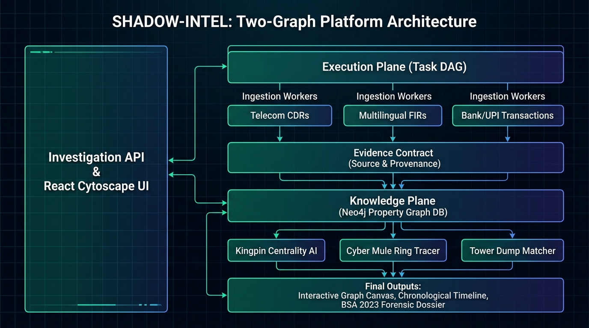

<div align="center">

# 🛡️ PROJECT SHADOW-INTEL
### **Next-Generation AI-Powered Criminal Network Analysis & Law Enforcement Intelligence Platform**

[](https://sih.gov.in)
[-003366.svg?style=for-the-badge&logo=shield)](https://www.mha.gov.in)
[](#)
[](#)
[](#)
[](#)

<p align="center">
  <b>De-anonymizing insulated criminal syndicates, multi-hop money mule rings, and burner phone swapping through multi-modal knowledge graph intelligence and blockchain-verified evidence custody.</b>
</p>

[🏛️ Architecture Blueprint](#-system-architecture-the-two-graph-model) •
[🔒 Blockchain Security](#-defense-grade-security--blockchain-evidence-locker) •
[🚀 Core Engines](#-the-6-core-intelligence-engines) •
[🌿 Git Branches](#-git-branching-strategy--workflow) •
[🚦 Quickstart](#-getting-started) •
[🏆 Winning Edge](#-smart-india-hackathon-winning-edge)

---
</div>

## 📌 Executive Summary & Problem Overview

* **Problem Statement ID:** `SIH26189`
* **Title:** **AI-Powered Criminal Network Analysis System**
* **Organization:** **Ministry of Home Affairs (MHA)** *(Supported by BPR&D / NCRB / I4C / NIA)*
* **Category:** Software / Cybersecurity / Defense Intelligence

### The Core Operational Challenge:
Modern organized crime syndicates—spanning cyber extortion rings, interstate drug cartels, hawala operators, and cross-border networks—operate in heavily compartmentalized layers. Investigating Officers (IOs) in Indian Law Enforcement Agencies (LEAs) face petabytes of disconnected, heterogeneous data dumps:

```text
┌─────────────────────────────────────────────────────────────────────────────┐
│                          HETEROGENEOUS POLICE DUMPS                         │
├─────────────────────────────────────────────────────────────────────────────┤
│ 📞 Telecom Data        │ CDRs, IPDRs & Tower Dumps (Airtel, Jio, Vi, BSNL) │
│ 📄 Police FIRs         │ CCTNS Scanned & Text Multilingual FIRs (Indic/Eng) │
│ 💳 Financial Logs      │ 1930 Portal Logs, Bank Statements & UPI VPAs       │
│ 📹 Vehicle Telemetry   │ ANPR Number Plates & FASTag Toll Checkpoints       │
│ 🛰️ Space / Satellite  │ Thuraya & Iridium Gateway Intercepts & GPS Fixes   │
└─────────────────────────────────────────────────────────────────────────────┘
```

**Project SHADOW-INTEL** solves this through a unified **Two-Graph Architecture**: combining a high-performance **Knowledge Graph (Neo4j)** for multi-hop criminal de-anonymization with an **Execution Graph (Task DAG)** for deterministic, parallel ingestion, anchored by an immutable **Blockchain Evidence Locker** strictly compliant with the **Bharatiya Sakshya Adhiniyam (BSA 2023)** and **Section 65B**.

---

## 🏛️ System Architecture: The Two-Graph Model

<div align="center">
  
</div>

The platform cleanly separates the **Investigation Reality** from the **Computation Workflow**:
* **1. Knowledge Graph (Neo4j):** Stores real-world entities (`Suspect`, `Phone`, `Device`, `Account`, `CellTower`, `FIRCase`) and multi-hop relationships (`CALLED`, `TRANSFERRED_TO`, `INSERTED_IN`, `CO_LOCATED_WITH`).
* **2. Execution Graph (Task DAG):** Schedules asynchronous source ingestion, dependency resolution, parallel worker fan-out, and evidence fusion.

---

## 🔒 Defense-Grade Security & Blockchain Evidence Locker

To guarantee that no outside hacker, corrupt insider, or defense lawyer can alter digital evidence or challenge police integrity, SHADOW-INTEL integrates a **Dual-Tier Blockchain Security Model**:

```text
[ Ingested Raw Evidence (CDR / FIR / Bank CSV) ]
                        │
                        ▼
         [ SHA-256 / Keccak-256 Hash ]
                        │
                        ▼
         [ Smart Contract: EvidenceLocker.sol ]
                        │
         ├── 1. Immutable Block Timestamp & Merkle Root
         ├── 2. Investigating Officer PKI Digital Signature
         └── 3. Automated BSA 2023 / Sec 65B Digital Certificate
```

### Key Security Guarantees:
* **Mathematical Tamper Detection:** If any database record or file is modified after ingestion, the live hash mismatches the on-chain hash, immediately raising a **CRITICAL TAMPERING ALERT**.
* **Immutable Audit Trail (`AuditTrail.sol`):** Every officer search, filter, and dossier export is permanently committed to the blockchain, eliminating repudiation.
* **Courtroom Public Verification:** Judges, prosecutors, and defense attorneys can verify the authenticity of exported investigation dossiers via an embedded QR code linking directly to on-chain block proofs.

---

## 🚀 The 6 Core Intelligence Engines

<details open>
<summary><b>1. 👑 Insulated Kingpin & Centrality Engine</b></summary>

* **Betweenness & PageRank:** Discovers top-level syndicate handlers who avoid direct contact with victims but act as critical communication bridges.
* **Louvain Community Detection:** Partitions massive graphs into functional cells (Mule Ring, Hawala, Enforcers, Logistics).
* **Link Prediction:** Surfaces hidden relationships between seemingly disconnected suspects using path-based graph algorithms.
</details>

<details open>
<summary><b>2. 📞 Telecom & Geo-Temporal Analytics Engine</b></summary>

* **IMEI-IMSI Swapping Resolver:** Bipartite graph mapping that aggregates 10+ discarded burner SIMs sharing a physical device into a single target.
* **Tower Dump Intersection:** Deterministic boolean filtering across crime scene geofences to isolate perpetrator devices from thousands of bystanders.
* **Satellite Phone Correlation:** Ingests Thuraya/Iridium gateway intercepts and correlates satellite GPS fixes with terrestrial GSM movements.
</details>

<details open>
<summary><b>3. 💳 Cyber Financial Fraud & Mule Ring Tracer (I4C / 1930 Portal)</b></summary>

* **Multi-Hop Layering:** Traces stolen cyber fraud funds fanning out through primary, secondary, and cashout mule accounts within minutes.
* **Smurfing Detection:** Flags micro-transactions structured to remain below banking AML reporting limits (e.g., ₹49,000).
* **Crypto-Fiat Bridges:** Traces off-ramping into USDT (TRC-20) and Bitcoin illicit wallets.
</details>

<details open>
<summary><b>4. 📄 Multilingual Indic Police NLP (CCTNS / ICJS)</b></summary>

* **Bhashini & IndicBERT NER:** Extracts suspect names, aliases, BNS/IPC sections, weapons, and vehicle plates from regional FIRs (Hindi, Marathi, Tamil, Telugu, English).
* **Modus Operandi (MO) Matcher:** Dense vector embeddings match new crime patterns against historical unsolved cases nationwide.
</details>

<details open>
<summary><b>5. ⛓️ Blockchain Evidence Locker & BSA 2023 Compliance</b></summary>

* **Cryptographic Ingestion Locks:** SHA-256 hash committed to EVM smart contracts.
* **Automated Section 65B Certificate:** Generates statutory electronic evidence affidavits with machine parameters and officer digital signatures.
</details>

<details open>
<summary><b>6. 🧠 Explainable AI (XAI) Investigator Copilot</b></summary>

* **Zero-Hallucination GraphRAG:** Translates natural language queries into deterministic Neo4j Cypher queries.
* **4-Tier Evidence Classification:** Every relationship is explicitly tagged as:
  * `[OBSERVED]` — Direct raw file fact.
  * `[DERIVED]` — Deterministic hardware/device match.
  * `[INFERRED]` — Centrality / Algorithmic risk score.
  * `[GENERATED]` — Human-readable NLP explanation.
</details>

---

## 🌿 Git Branching Strategy & Workflow

Our repository follows a structured, production-grade **Git-Flow Model**:

```text
main (Production / Presentation Ready)
  │
  └── develop (Central Integration Hub)
        │
        ├── feature/execution-core-contract    # Task DAG & Standard Evidence Schema
        ├── feature/blockchain-evidence-locker  # Smart Contracts, SHA-256 Hashing & BSA 2023
        ├── feature/telecom-cdr-analytics      # Indian CDRs, Tower Dumps & IMEI Hopping
        ├── feature/financial-mule-tracer      # UPI Layering, Bank Statements & Crypto
        ├── feature/nlp-fir-intelligence       # Multilingual FIRs & Bhashini NER
        ├── feature/graph-knowledge-engine     # Neo4j Property Graph & Kingpin AI
        └── feature/frontend-dashboard         # React Command Center UI & Cytoscape Canvas
```

---

## 🛠️ Technology Stack

| Layer | Technologies | Purpose |
|---|---|---|
| **Frontend UI / UX** | React 19, TypeScript, Vite, TailwindCSS | High-speed, dark-mode Tactical Command Center |
| **Graph Visualizer** | Cytoscape.js, Dagre Layout, Leaflet (GIS) | 2D interactive canvas, node inspection, spatial maps |
| **Backend & API** | Python 3.10+, FastAPI (Async REST), Pydantic v2 | High-performance asynchronous API endpoints |
| **Knowledge Graph** | Neo4j 5.x Community / Enterprise, Cypher (ISO GQL) | Disk-backed native property graph database |
| **Analytics Engine** | NetworkX, Polars, Scikit-Learn | Fast centrality scoring, community clustering & CDR filtering |
| **NLP & Semantics** | spaCy, IndicBERT / Bhashini API, Transformers | Multilingual FIR entity extraction & MO matching |
| **Security & Blockchain**| Solidity, Web3.py, PyCryptodome, SHA-256 | Immutable evidence ledger & BSA 2023 compliance |
| **Containers & DevOps** | Docker, Docker Compose | One-command full-stack containerized deployment |

---

## 🚦 Getting Started

> **This section describes the target deployment.** For what runs today, see
> **[docs/DEVELOPMENT.md](docs/DEVELOPMENT.md)** — local setup, the Neo4j
> lifecycle, seeding and the test suite. The backend and Neo4j are implemented
> and start with `docker compose up -d`; there is no frontend service yet, so
> nothing serves port 5173. [docs/IMPLEMENTATION_STATE.md](docs/IMPLEMENTATION_STATE.md)
> tracks which subsystems exist.

### Prerequisites
* **Python** >= 3.10
* **Node.js** >= 18.x
* **Docker & Docker Compose**

### 1. Clone & Setup
```bash
git clone https://github.com/moulishvarmajv/sih-26.git
cd sih-26
```

### 2. Launch via Docker Compose
```bash
docker-compose up --build -d
```

### 3. Access Services
* 🖥️ **Investigator Command Center:** `http://localhost:5173`
* 📑 **FastAPI Swagger API Docs:** `http://localhost:8000/docs`
* 🕸️ **Neo4j Graph Browser:** `http://localhost:7474`
* 📄 **Interactive Architecture Lab:** Open [`docs/project_overview.html`](docs/project_overview.html) in your browser.

---

## 🏆 Smart India Hackathon Winning Edge

1. **Zero-LLM Core Resilience:** Zero reliance on fragile external LLM APIs for core crime-solving logic. The system never crashes due to API downtime or rate limits.
2. **True Indian LEA Grounding:** Real Airtel/Jio CDR headers, CCTNS BNS sections, 1930 portal formats, and Indic language support.
3. **Court-Ready Forensics:** Digital evidence is 100% admissible under the Bharatiya Sakshya Adhiniyam (BSA 2023) and Section 65B.
4. **Intuitive Operational Cockpit:** Sub-second multi-hop graph queries with chronological timeline replay and explainable AI insights.

---

<div align="center">
  <b>Developed for the Ministry of Home Affairs (MHA) | Smart India Hackathon 2026 | Problem Statement SIH26189</b><br/>
  <i>Law Enforcement Intelligence • Graph AI • Blockchain Evidence Locker</i>
</div>
